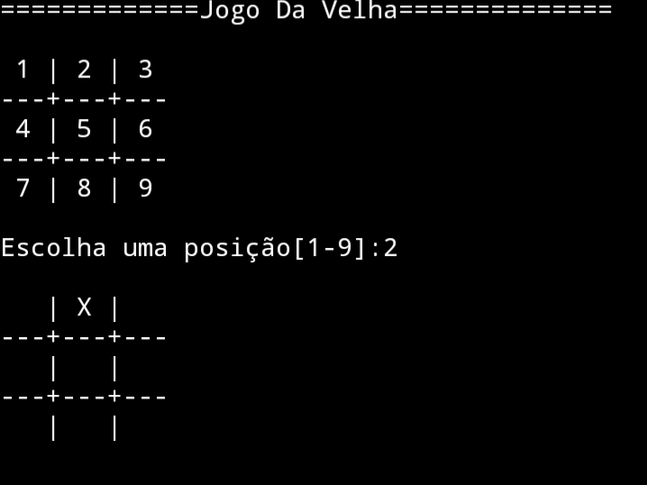

## Jogo da Velha

O Jogo da Velha é um jogo de passatempo popular com regras bem simples. Provavelmente você
já deve ter jogado quando criança. É também um ótimo desafio para praticar lógica de programação. Pensando nisso, resolvi implementar esse jogo utilizando Python.
Inicialmente, a ideia é que o usuário possa jogar contra a máquina. Para isso, o primeiro passo foi gerar as jogadas adversárias de forma arbitrária. 
Assim, no decorrer do desenvolvimento vamos buscar diferentes formas de gerar jogadas estratégicas.




## Algumas observações sobre o script

  * Visando oferecer uma melhor compreensão do código eu optei por refatorar todo o loop principal de jogo, deixando o código mais limpo e o fluxo da lógica mais claro. Com isso, o script ficou um pouco maior que o código inicial que fiz.
  * Também defini dois tipos de jogadores: `Principal` e `Secundário`. O jogador principal representa o usuário. Já o jogador secundário representa a "máquina".
  * Os marcadores X e O representam os jogadores no jogo. Para decidir quem será X ou O basta alterar as seguintes linhas:
```python
JOGADOR_PRINCIPAL = x  #define que o jogador principal será X 
JOGADOR_SECUNDARIO = o #define que o jogador secundário será O

```
  * Para definir quem começa a partida basta alterar o valor da variável  `posicao` para `JOGADOR_SECUNDARIO` ou para `JOGADOR_PRINCIPAL`:
```python
def iniciar_jogo():
    fim_de_jogo = False
    numero_de_jogadas = 0 #número de jogadas realizadas
    jogador = JOGADOR_PRINCIPAL #define quem inicia a partida: X ou O
    ...
```
    